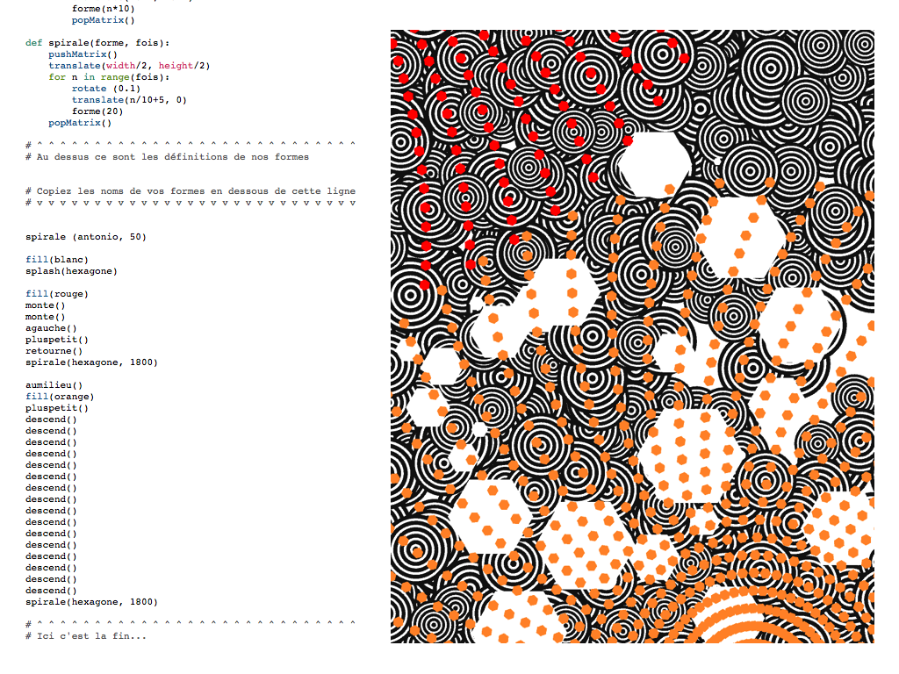

Du code, des couleurs et des cookies
=====================
*[README in english: [README.en.md](README.en.md)]*

Code pour l'atelier Du code, des couleurs et des cookies créé pour le Centre Pompidou.

Les enfants remixent du code informatique pour produire des formes, des couleurs. Ils ajoutent, copient-collent, transforment leur code, et voient les images changer et évoluer sous leurs yeux, projetées par 12 vidéo-projecteurs sur les murs – c’est à dire 1 vidéo-projecteur par enfant ! Pendant les 2 heures de l'atelier, les enfants partent aussi à la rencontre dans le musée de 3 tableaux de Kupka, Valensi et McDonald Wright de 1920 à 1955. Ils découvrent que le code nous les fait revoir autrement– et rapporte des idées fraiches pour leur programme : "On a essayé d'imaginer comment programmer les formes que nous avons vu dans les peintures".

Les créations des enfants : https://github.com/juliendorra/cookies-code-couleurs/blob/master/cre%CC%81ations/README.md

Nous utilisons Processing en Mode Python, pour la clarté de la syntaxe, pour la lisibilité des paramètres nommés, et pour la facilité à passer une fonction comme paramètre à une autre fonction.

Ce post raconte brièvement l'enjeu du format au plan artistique, de la médiation et pédagogique : [http://ils.sont.la/post/programmer-au-musee-le-code-creatif-materiau-mediation](http://ils.sont.la/post/programmer-au-musee-le-code-creatif-materiau-mediation)

Un atelier conçu par [Julien Dorra](http://twitter.com/juliendorra) et [Jonathan Perret](http://twitter.com/jonathanperret)

