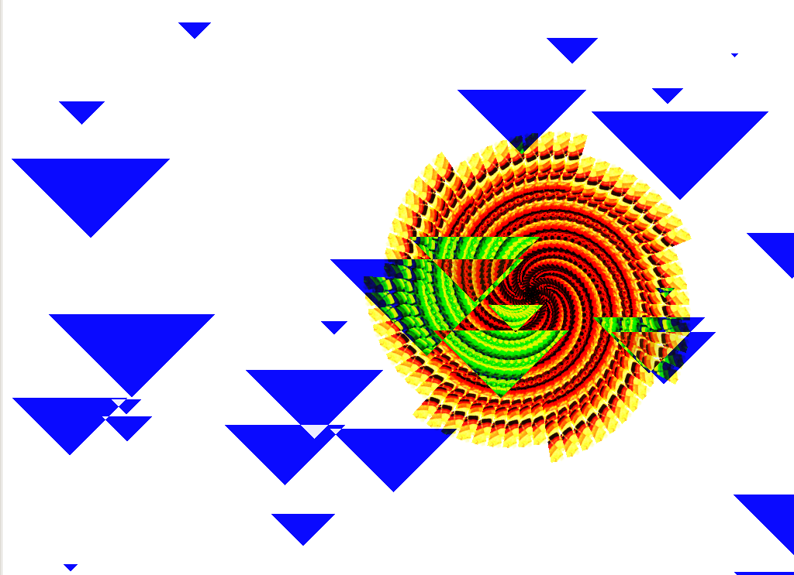
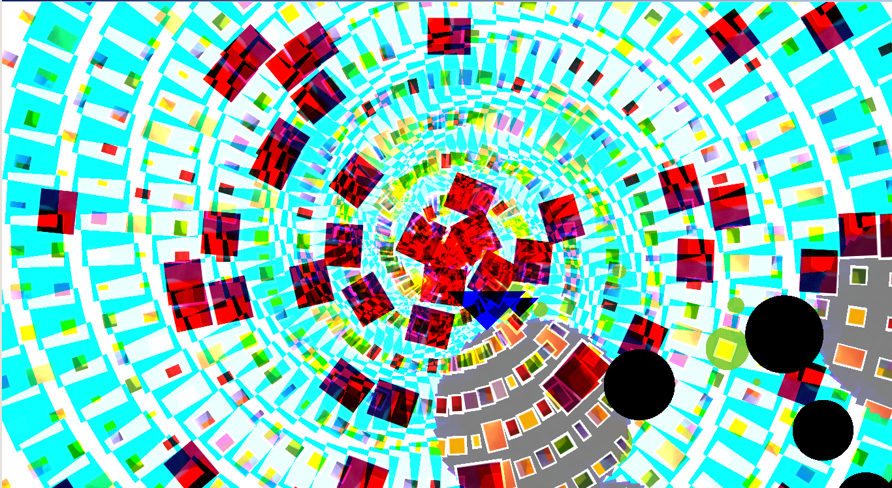

## les créations lors de l'atelier

Dans [ce dossier](https://github.com/juliendorra/cookies-code-couleurs/tree/master/cre%CC%81ations) vous trouverez quelques sketches et quelques captures d'écran des créations lors des ateliers du 8 juin 2014 et 6 décembre 2014 au Centre Pompidou.

#### 6 décembre 2014

Marion

### 8 juin 2014

Julien N

Jeanne B

Margot 

Romain

Mika

Jeanne HD

Le grand Raphaël !

