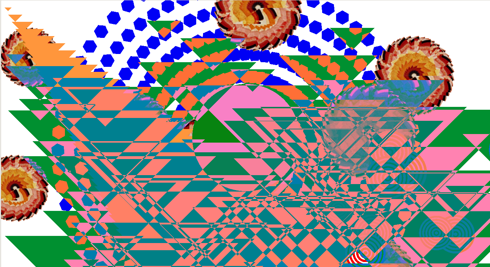

## les créations lors de l'atelier

Dans ce dossier vous trouverez quelques sketches et quelques captures d'écran des créations lors de l'atelier du 8 juin 2014 au Centre Pompidou.

Julien

Jeanne B

Romain

Mika

Jeanne HD

